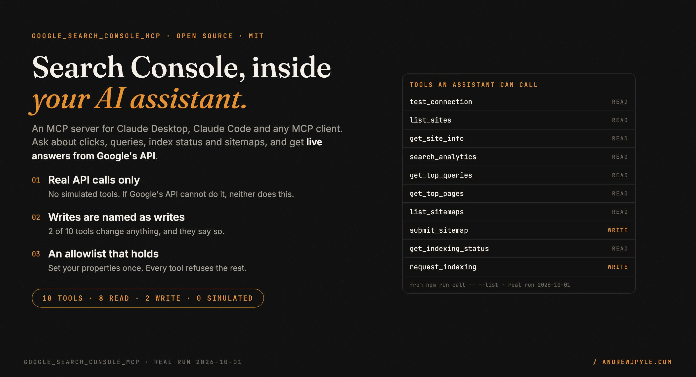
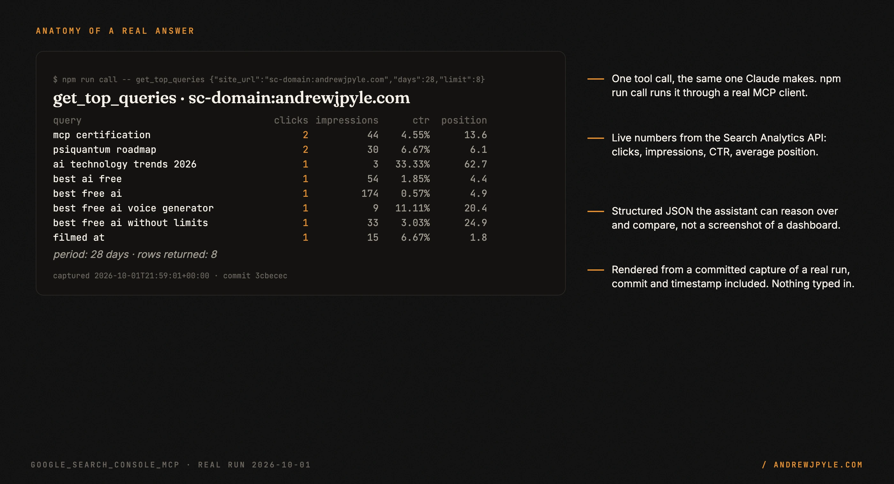
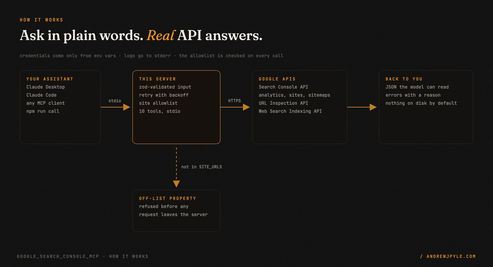
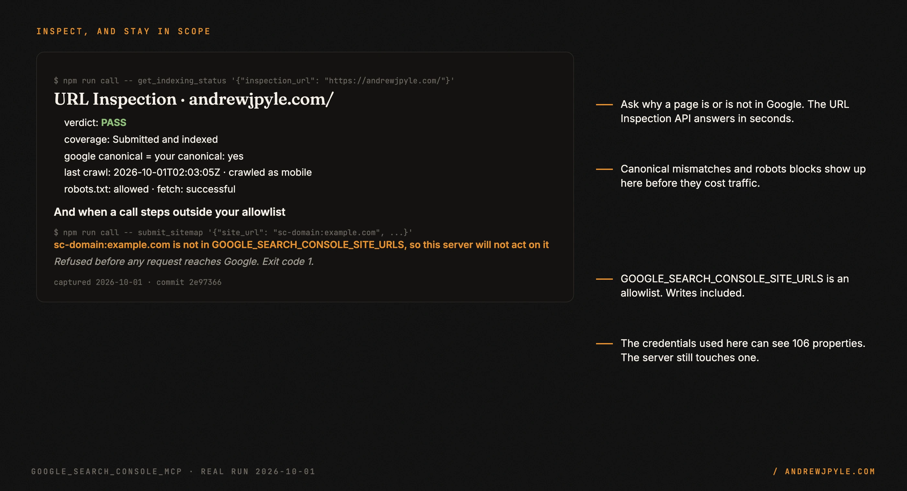

<p align="center">
  
</p>

<p align="center">
  <a href="https://github.com/andrewjpyle/google_search_console_mcp/actions/workflows/ci.yml"></a>
  
  
  
</p>

# Google Search Console for your AI assistant

A [Model Context Protocol](https://modelcontextprotocol.io) server that lets Claude Desktop, Claude
Code, or any MCP client ask Google Search Console real questions: which queries bring clicks, whether
a page is indexed and why, which sitemaps Google has. Every tool is a live call to Google's API.

- **10 tools, 0 simulated.** Search analytics, top queries and pages, URL Inspection, sitemaps,
  and Indexing API notifications. If Google's public API cannot do something, this server does not
  pretend to.
- **Writes are named as writes.** 2 of the 10 tools change anything (`submit_sitemap`,
  `request_indexing`), and their descriptions say so to the model.
- **An allowlist that holds.** Set `GOOGLE_SEARCH_CONSOLE_SITE_URLS` and every tool, writes
  included, refuses any other property.
- **Try it without a client.** `npm run call` runs any tool from your terminal through a real MCP
  client, the same path Claude uses.

> **The one idea worth stealing, even if you never run this code:** put an AI tool's boundary in
> config the tool enforces, not in instructions the model is asked to follow. "Only touch
> example.com" in a prompt is a request. `GOOGLE_SEARCH_CONSOLE_SITE_URLS=sc-domain:example.com`
> here is a wall: a call for any other property fails before a request leaves the server.

---

## 60 seconds to a first answer

```bash
git clone https://github.com/andrewjpyle/google_search_console_mcp.git
cd google_search_console_mcp
npm install && npm run build
npm run call -- --list          # no credentials needed: lists the 10 tools
```

Add credentials (see [Configuration](#configuration)), then ask a real question:

```bash
npm run call -- get_top_queries '{"site_url": "sc-domain:example.com", "days": 28, "limit": 8}'
```

This is the real answer for andrewjpyle.com, trimmed:

```json
{
  "top_queries": [
    { "query": "mcp certification",  "clicks": 2, "impressions": 44, "ctr": "4.55%", "position": "13.6" },
    { "query": "psiquantum roadmap", "clicks": 2, "impressions": 30, "ctr": "6.67%", "position": "6.1" },
    { "query": "best free ai",       "clicks": 1, "impressions": 174, "ctr": "0.57%", "position": "4.9" }
  ],
  "period": "28 days",
  "rowCount": 8
}
```

<p align="center"></p>

## Connect it to Claude

**Claude Code**

```bash
claude mcp add google-search-console \
  -e GOOGLE_SEARCH_CONSOLE_CREDENTIALS="$(cat service-account.json | tr -d '\n')" \
  -e GOOGLE_SEARCH_CONSOLE_SITE_URLS="sc-domain:example.com" \
  -- node /absolute/path/to/google_search_console_mcp/dist/index.js
```

**Claude Desktop** (`claude_desktop_config.json`)

```json
{
  "mcpServers": {
    "google-search-console": {
      "command": "node",
      "args": ["/absolute/path/to/google_search_console_mcp/dist/index.js"],
      "env": {
        "GOOGLE_SEARCH_CONSOLE_CREDENTIALS": "{...service account json on one line...}",
        "GOOGLE_SEARCH_CONSOLE_SITE_URLS": "sc-domain:example.com"
      }
    }
  }
}
```

Then ask things like *"What were my top queries for example.com over the last 28 days?"* or
*"Is https://example.com/pricing indexed, and if not, why?"*

## The tools

| Tool | Type | What it does |
|------|------|--------------|
| `test_connection` | read | Verify auth and count the properties the credentials can see |
| `list_sites` | read | List the properties on the account |
| `get_site_info` | read | Permission level and details for one property |
| `search_analytics` | read | Clicks, impressions, CTR and position by query, page, country, device or date |
| `get_top_queries` | read | Top queries over a lookback window |
| `get_top_pages` | read | Top pages over a lookback window |
| `list_sitemaps` | read | Sitemaps submitted for a property |
| `get_indexing_status` | read | URL Inspection API: verdict, coverage, canonicals, robots, last crawl |
| `submit_sitemap` | **write** | Submit or resubmit a sitemap |
| `request_indexing` | **write** | Notify Google of a new or updated URL through the Web Search Indexing API |

## How it works

<p align="center"></p>

Your MCP client starts the server and talks to it over stdio. Each call is validated with zod,
checked against the allowlist, then sent to the Search Console API, the URL Inspection API or the
Web Search Indexing API, with retry and backoff on rate limits and transient errors. The answer
comes back as JSON the model can read.

Two hygiene rules a stdio server has to get right, and this one tests:

- **stdout is only for the protocol.** Every log line goes to stderr. A test starts the server and
  fails if a single stdout line is not JSON-RPC.
- **Nothing on disk by default.** File logs are written only when you set `LOG_DIR`.

## Stay in scope

<p align="center"></p>

The credentials behind these examples can see 106 Search Console properties. With
`GOOGLE_SEARCH_CONSOLE_SITE_URLS=sc-domain:andrewjpyle.com`, the server answered for exactly one,
and refused a `submit_sitemap` for anything else before any request reached Google.

## Configuration

Credentials are read only from environment variables. Copy `.env.example` to `.env`, or pass them
from your MCP client's config.

| Variable | Required | What it does |
|---|---|---|
| `GOOGLE_SEARCH_CONSOLE_CREDENTIALS` | one auth method | Service-account JSON on one line. Add the service-account email as a user on each property. |
| `GOOGLE_SEARCH_CONSOLE_CLIENT_ID`, `_CLIENT_SECRET`, `_REFRESH_TOKEN` | one auth method | OAuth2 for a user's own Google account. |
| `GOOGLE_SEARCH_CONSOLE_SITE_URLS` | recommended | Comma-separated **allowlist**. When set, every tool refuses other properties. The first entry is the default when a call omits `site_url`. |
| `GOOGLE_SEARCH_CONSOLE_SITE_URL` | no | Explicit default property. It must also be on the allowlist when one is set. |
| `LOG_LEVEL` | no | `error`, `warn`, `info` (default) or `debug`. Logs go to stderr. |
| `LOG_DIR` | no | Write daily-rotated JSON logs here, kept 30 days. Unset means no files. |

Requires Node 20 or newer, a Google Cloud project with the Search Console API enabled, and
credentials with access to the properties you want.

## Scope: what it does not do

Google's public API covers only part of what the Search Console UI can do. Disavow files, hreflang
settings, crawl rate, URL parameters, adding or removing properties, and URL removals **have no
public API**, so they are not here, rather than shipped as fake tools. Google retired the
crawl-errors API in 2019, so that is omitted too.

## The patterns

| Pattern | The failure it prevents |
|---|---|
| Real API calls only | a tool that "succeeds" without doing anything |
| Writes labeled in the tool description | a model that submits a sitemap thinking it is reading one |
| Allowlist enforced in code | a prompt that says "only example.com" and a call that goes elsewhere |
| stdout reserved for the protocol | a log line that breaks a strict MCP client mid-session |
| No files unless asked | tool arguments quietly piling up in `./logs` for 30 days |
| Say what the API cannot do | users trusting a disavow tool that never existed |

## FAQ

**Do I need Claude to try it?** No. `npm run call -- --list` works with no credentials, and
`npm run call -- <tool> '<json>'` runs any tool through a real MCP client.

**Can the model submit a sitemap for a site I did not intend?** Not if you set
`GOOGLE_SEARCH_CONSOLE_SITE_URLS`. Without it, the credentials' own access is the only limit, so set it.

**Why a service account?** It is the easiest way to give a server read access to exactly the
properties you add it to, with no browser sign-in. OAuth2 works too.

**Does it cache or store results?** No. Each call goes to Google. Nothing is written to disk unless
you set `LOG_DIR`.

## Development

```bash
npm test            # builds, then runs the jest suite (39 tests)
npm run dev         # run from source with tsx
npm run call -- --list
```

## Security

- Credentials come only from environment variables; nothing is hardcoded.
- `.env`, `*credentials*.json` and `logs/` are gitignored.
- Set `GOOGLE_SEARCH_CONSOLE_SITE_URLS` to exactly the properties you want the assistant to reach.
  It is enforced for every tool, including the two writes.

## Roadmap

- A read-only mode that hides the two write tools entirely
- A period-over-period comparison tool (this 28 days vs the previous 28)
- Remote use over MCP's Streamable HTTP transport

## License

MIT. By [Andrew Pyle](https://andrewjpyle.com).
